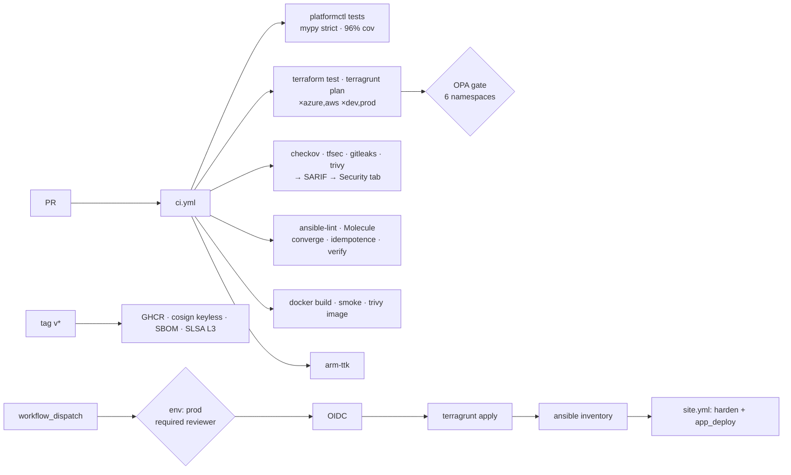

# secure-api-platform

[](https://github.com/any2names/phil-DevSecOps-projects/actions/workflows/ci.yml)
[](https://github.com/any2names/phil-DevSecOps-projects/actions/workflows/release.yml)
  

A reference DevSecOps platform: a small FastAPI service deployed onto CIS-hardened VMs in **Azure and AWS** with Terraform/Terragrunt and an ARM template, configured by Ansible, orchestrated by a typed Python CLI (`platformctl`), and gated by OPA policy and security scanners in GitHub Actions. Releases are keyless-signed with an SBOM and SLSA provenance.

**Everything in CI runs with zero cloud credentials.** The pipeline proves the infrastructure is correct, policy-compliant, scanned and signed — including a real `terragrunt plan` for all four cloud/environment units. Applying is a separate, manually-triggered, reviewer-gated workflow that uses OIDC federation (no stored secrets) once accounts exist.



## Skills → where to look

| Skill | Evidence |
|---|---|
| Infrastructure as code | [`infra/terraform/modules`](infra/terraform/modules) — 3 module families × 2 clouds, variable validation, `terraform test` with mock providers |
| Terraform / Terragrunt | [`infra/terragrunt.hcl`](infra/terragrunt.hcl) derives env+cloud from the path and generates provider and backend; [ADR-0002](docs/adr/0002-terragrunt-over-workspaces.md) |
| ARM templates | [`infra/arm/keyvault.json`](infra/arm/keyvault.json) deployed by [`modules/secrets/azure`](infra/terraform/modules/secrets/azure/main.tf); validated by arm-ttk in CI; [ADR-0006](docs/adr/0006-arm-wrapped-in-terraform.md) |
| Ansible | [`ansible/roles/harden`](ansible/roles/harden), [`ansible/roles/app_deploy`](ansible/roles/app_deploy); Molecule scenario runs converge + idempotence + verify in a systemd container |
| Workflow orchestration | [`platformctl`](platformctl) — plan → policy → scan → drift → inventory → sign/verify, one typed CLI |
| Cloud-native automation | Dynamic inventory from Terraform outputs; the VM identity fetches secrets at service start ([`fetch-secret.sh.j2`](ansible/roles/app_deploy/templates/fetch-secret.sh.j2)) — no credentials on disk |
| GitHub / GitHub Actions | [`.github/workflows`](.github/workflows) — reusable workflows, matrix plans, SHA-pinned actions (enforced by [`platformctl actions pin --check`](platformctl/platformctl/actions.py)), least-privilege `permissions`, SARIF to the Security tab, Dependabot, CODEOWNERS |
| Advanced Python | [`platformctl/platformctl`](platformctl/platformctl) — typer + pydantic + structlog, adapter pattern, hypothesis property tests, `mypy --strict`, ≥ 85% coverage |
| Secure by design | [Threat model](docs/threat-model.md); hardened systemd unit; IMDSv2; encryption everywhere; fail-fast app; egress limited to 443/80/53/123 |
| Policy as code | [`policy/terraform`](policy/terraform) — 6 OPA namespaces with 27 unit tests, evaluated on real plan JSON; Checkov alongside |
| CI/CD with integrated security | [`ci.yml`](.github/workflows/ci.yml): fmt → validate → test → plan → OPA → scanners → Molecule → image scan, all blocking; every remaining suppression carries a written justification |
| Secrets management | Key Vault (RBAC, purge protection) and Secrets Manager (CMK); no secret values in IaC ([policy](policy/terraform/secrets.rego)); [`platformctl secrets rotate`](platformctl/platformctl/secrets.py); [runbook](docs/runbooks/rotate-secrets.md) |
| Certificate management | ACME via certbot with renewal timer, TLS 1.2+ nginx; [`platformctl certs check`](platformctl/platformctl/certs.py) |
| Supply chain | [`release.yml`](.github/workflows/release.yml): digest-pinned image, syft SBOM, cosign keyless sign + attest, SLSA L3 provenance; [ADR-0005](docs/adr/0005-keyless-cosign.md) |

## Quickstart

```bash
git clone https://github.com/any2names/phil-DevSecOps-projects && cd phil-DevSecOps-projects
make bootstrap          # venv, editable installs, pre-commit hooks
make ci                 # everything CI runs that doesn't need Docker
.venv/bin/platformctl --help
```

Requires: Python 3.12+, Terraform ≥ 1.7, terragrunt, conftest, checkov, gitleaks, tfsec, trivy
(`brew install hashicorp/tap/terraform terragrunt conftest gitleaks tfsec trivy && uv tool install checkov`).

Try the gate on a real plan — no cloud account needed ([ADR-0007](docs/adr/0007-hermetic-azure-plan.md) explains how):

```bash
.venv/bin/platformctl plan aws dev      # 25 resources, 16 policy checks
.venv/bin/platformctl plan azure prod   # 14 resources, 16 policy checks
```

## Repository map

```
platformctl/   Python CLI (orchestration, parsing, gating)        docs/architecture.md   diagrams
infra/         Terraform modules, stacks, Terragrunt envs, ARM    docs/threat-model.md   STRIDE
ansible/       harden + app_deploy roles, Molecule                docs/adr/              decisions (7)
policy/        OPA/Rego + tests                                   docs/runbooks/         operations (4)
app/           FastAPI service + Dockerfile                       .github/workflows/     ci, release, apply
scripts/       az CLI shim for hermetic Azure plans
```

## What does *not* happen without cloud accounts

- `apply.yml` never runs here. [docs/runbooks/deploy.md](docs/runbooks/deploy.md) lists the one-time OIDC and state-backend setup.
- Placeholders that must be replaced before a real apply: `tfstate-placeholder*` (backends), `ami-0123456789abcdef0`, `203.0.113.0/24` (admin CIDR), `PLATFORM_SSH_PUBLIC_KEY`.
- The `azure` and `aws` adapters in `platformctl` are exercised only against live SDKs; CI uses the `fake` adapter.

## Future work

Bastion/private-endpoint variant with no public VM IP · multi-region · HashiCorp Vault as a third adapter · cost estimation (Infracost) in the plan gate · scheduled drift detection once accounts exist.

## License

MIT — see [LICENSE](LICENSE).
