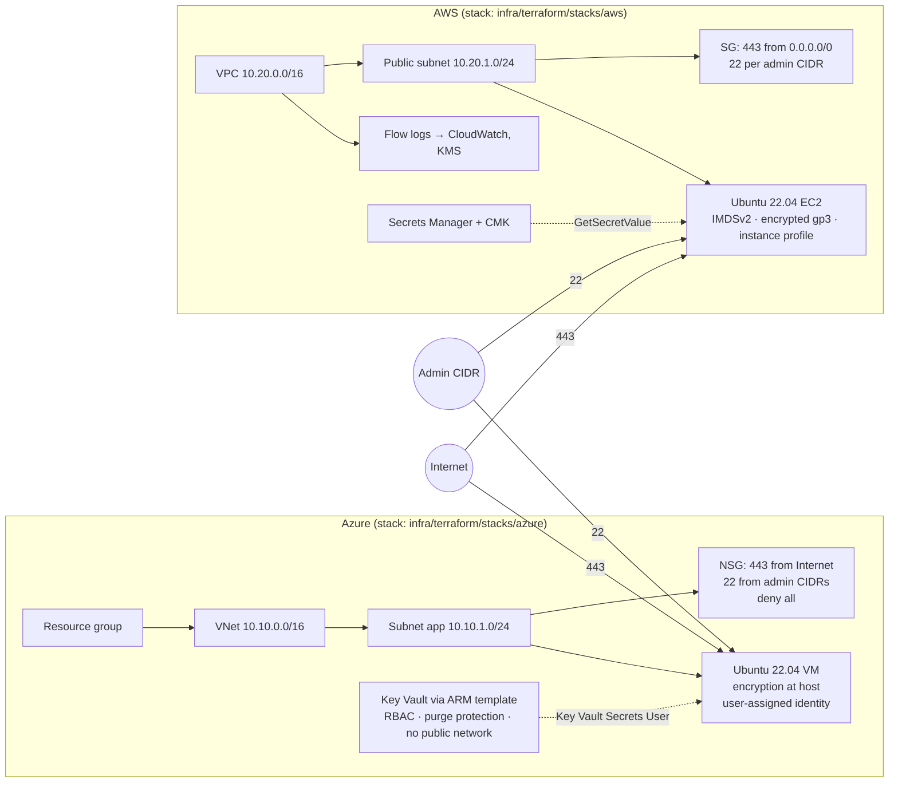
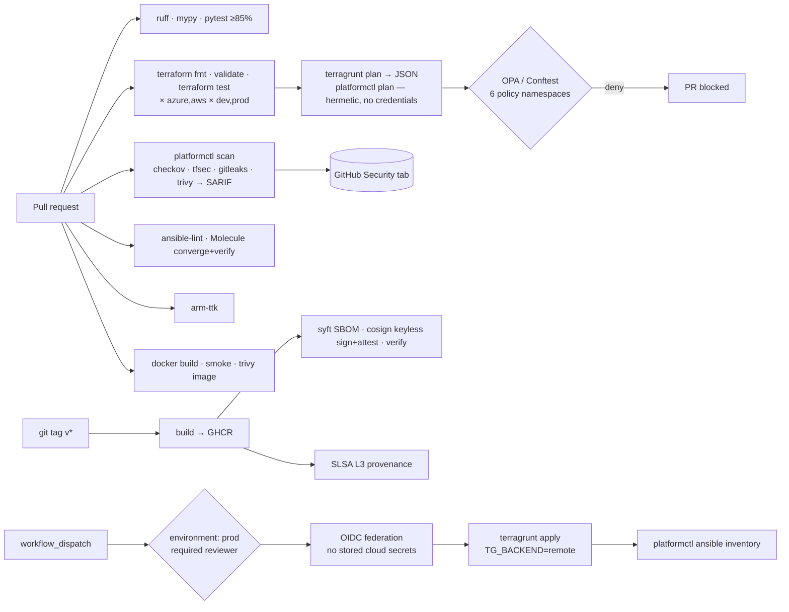
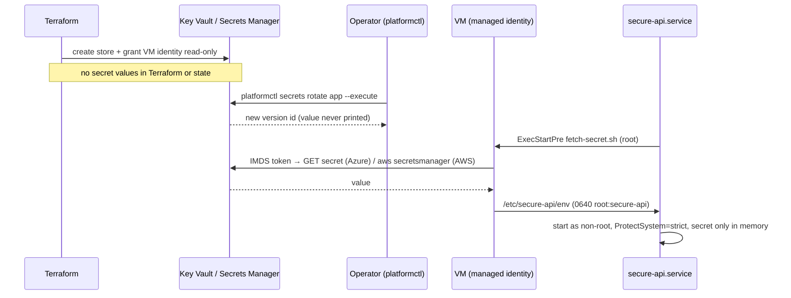

# Architecture

## Infrastructure topology

Both stacks expose the same outputs (`vm_public_ip`, `vm_private_ip`, `secret_store_id`, `secret_store_uri`, `identity_id`), which is what lets `platformctl ansible inventory` and the Ansible roles be cloud-agnostic ([ADR-0001](adr/0001-multi-cloud-module-contract.md)).

## Pipeline

## Identity and secret flow

## Component responsibilities

| Component | Owns | Does not own |
|---|---|---|
| Terraform modules | resources, security defaults, variable validation | environment values, state config |
| Terragrunt | env/cloud layering, backend and provider generation | resource definitions |
| ARM template | Key Vault definition | who can read it (Terraform role assignment) |
| OPA policies | what a plan may contain | how resources are built |
| Ansible | OS hardening, service deployment, secret fetch script | provisioning |
| platformctl | orchestration, parsing, reporting, gating | any cloud resource definition |
| GitHub Actions | ordering, isolation, permissions, artifacts | logic (delegates to platformctl / make) |
